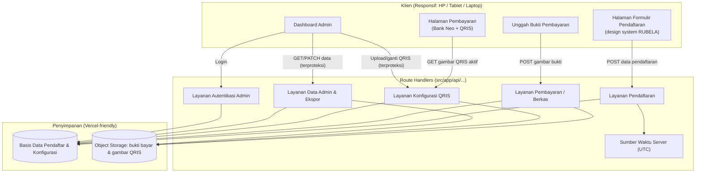
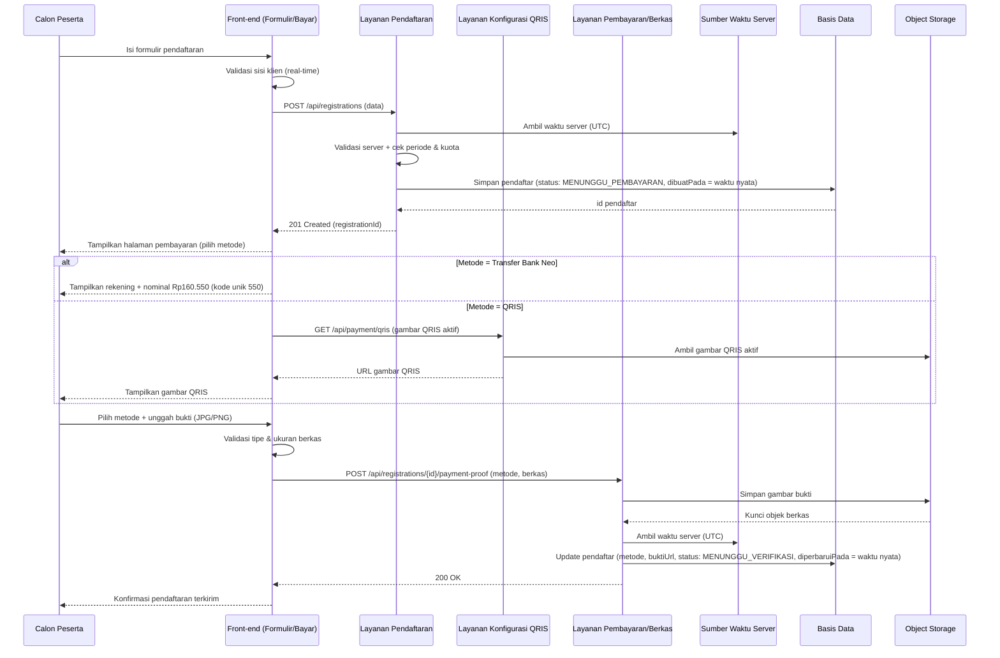
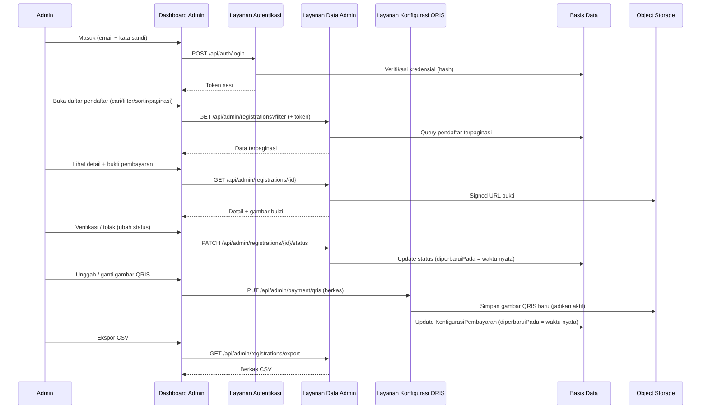

# Dokumen Desain: Pendaftaran Bimbel (Widya Nusantara Academy)

## Overview

Fitur ini adalah alur **pendaftaran bimbel online** untuk **Widya Nusantara Academy** (bagian dari **Rubela Indonesia / Rubela UTBK Indonesia**) yang dibangun **langsung di dalam** proyek webprofile yang sudah ada (Next.js 16 App Router + React 19 + TypeScript + Tailwind CSS v4). Fitur ini menggantikan pencatatan manual berbasis Google Sheets dengan sebuah sistem terintegrasi: **formulir pendaftaran**, **halaman pembayaran dua metode** (Transfer Bank Neo dan QRIS), **unggah bukti pembayaran**, serta **Dashboard Admin** untuk verifikasi manual dan pengelolaan data pendaftar.

Program yang didaftarkan berfokus pada persiapan **UTBK-SNBT & seleksi mandiri PTN** untuk siswa **Kelas 12 dan Gap Year**. Ketentuan program yang dikonfirmasi: biaya **Rp160.000 untuk 5 bulan**, **kuota 100 murid**, dan **periode pendaftaran 6 April 2026 – 27 September 2026**. Situs di-*deploy* ke **Vercel** pada domain **www.widyautbk.site**. Kontak resmi: **WhatsApp 0895360396759** dan **Gmail widyaakademi@gmail.com**. Program juga menjalankan skema **referral Rp10.000** untuk setiap teman yang berhasil mendaftar dan membayar.

Halaman pendaftaran dan pembayaran **wajib memakai design system RUBELA** serta komponen UI/layout yang sudah tersedia di `src/components` (mis. `Navbar`, `Footer`, `Container`, `Section`, `Heading`, `Card`, `Button`, `Badge`, `CTA`) agar konsisten secara visual dengan webprofile. Endpoint dibangun memakai **Next.js App Router Route Handlers** (`src/app/api/...`). Seluruh *timestamp* memakai **waktu server nyata** (bukan nilai palsu/hardcoded): disimpan dalam **UTC** dan ditampilkan dalam zona **Asia/Jakarta (WIB)**, dan waktu nyata inilah yang dipakai untuk `dibuatPada`/`diperbaruiPada` maupun validasi periode pendaftaran.

Karena stack sudah pasti (Next 16, React 19, TypeScript, Tailwind v4), kontrak antarmuka pada dokumen ini ditulis dalam **TypeScript** agar langsung dapat dipetakan ke implementasi. Pilihan basis data terkelola dan penyimpanan berkas yang cocok untuk Vercel dibahas pada bagian [Dependencies](#dependencies).

---

## Architecture

### Diagram Arsitektur Tingkat Tinggi



### Alur Utama (Sequence Diagram)

**1. Alur Pendaftaran → Pilih Metode Bayar → Unggah Bukti**



**2. Alur Admin: Verifikasi & Kelola QRIS**



### Prinsip Arsitektur

- **Terintegrasi dengan webprofile**: fitur ditambahkan ke proyek Next.js yang sama, bukan aplikasi terpisah. Halaman baru (`/pendaftaran`, `/pembayaran`, `/admin`) memakai layout, `Navbar`, `Footer`, dan komponen UI RUBELA yang ada.
- **Pemisahan area publik dan admin**: endpoint pendaftaran & pengambilan gambar QRIS aktif bersifat publik; seluruh endpoint `/api/admin/*` (termasuk upload QRIS) membutuhkan autentikasi.
- **Mobile-first & responsif**: tata letak mengikuti breakpoint Tailwind v4 (`sm 640`, `md 768`, `lg 1024`) yang sudah didefinisikan di `globals.css`, dioptimalkan untuk smartphone, tablet, dan laptop.
- **Sumber data tunggal**: basis data menggantikan Google Sheets, dengan ekspor CSV untuk kompatibilitas kebiasaan lama.
- **Waktu nyata (real time)**: satu sumber waktu server (UTC) dipakai untuk semua *timestamp* dan validasi periode; tidak ada waktu yang di-hardcode.
- **QRIS dinamis**: gambar QRIS tidak di-hardcode — diunggah admin melalui dashboard, disimpan di object storage, dan ditampilkan ke peserta melalui endpoint publik.

---

## Components and Interfaces

### Komponen 1: Halaman Formulir Pendaftaran (Front-end Publik)

**Tujuan**: Menampilkan formulir pendaftaran responsif dengan komponen RUBELA dan memvalidasi input secara real-time sebelum dikirim ke server.

**Tanggung jawab**:
- Menampilkan field sesuai [Data Models](#data-models): Nama Lengkap, Asal Sekolah, Tanggal Lahir, Status Pendidikan, Nomor WhatsApp, Username Instagram, Gmail Aktif.
- Validasi sisi klien (field wajib, format Gmail, format nomor WhatsApp, pilihan Status Pendidikan yang sah, tanggal lahir masuk akal).
- Menampilkan pesan galat yang jelas dan mudah dibaca di layar kecil.
- Menampilkan informasi program (Rp160.000 / 5 bulan) dan status ketersediaan kuota.
- Mengarahkan peserta ke halaman pembayaran setelah pendaftaran berhasil.

**Antarmuka**:

```typescript
interface KomponenFormulirPendaftaran {
  render(): TampilanFormulir;
  // { valid: boolean; galat: PesanGalat[] }
  validasiKlien(data: DataFormulirPendaftaran): HasilValidasi;
  // memanggil POST /api/registrations
  kirim(data: DataFormulirPendaftaran): Promise<HasilPendaftaran>;
}
```

### Komponen 2: Halaman Pembayaran (Front-end Publik)

**Tujuan**: Menampilkan dua metode pembayaran dan membiarkan peserta memilih salah satu, lalu mengunggah bukti.

**Tanggung jawab**:
- Menampilkan **Transfer Bank Neo**: nomor rekening `5859459250325726` a/n **Haposan Sinaga** dan **nominal transfer Rp160.550** (harga Rp160.000 + kode unik `550` sebagai 3 digit terakhir), disertai penjelasan pentingnya kode unik untuk verifikasi manual.
- Menampilkan **QRIS**: mengambil gambar QRIS **aktif** dari endpoint publik `GET /api/payment/qris` (gambar yang diunggah admin), bukan gambar hardcoded.
- Memungkinkan peserta memilih metode (`TRANSFER_BANK_NEO` atau `QRIS`).
- Menautkan ke komponen unggah bukti.

**Antarmuka**:

```typescript
interface KomponenHalamanPembayaran {
  // Detail statis Bank Neo (rekening, atas nama, nominal, kode unik)
  ambilInfoBankNeo(): InfoTransferBankNeo;
  // GET /api/payment/qris → URL gambar QRIS aktif
  ambilGambarQrisAktif(): Promise<{ qrisUrl: string } | null>;
  pilihMetode(metode: MetodePembayaran): void;
}
```

### Komponen 3: Komponen Unggah Bukti Pembayaran

**Tujuan**: Memungkinkan peserta mengunggah gambar bukti pembayaran (transfer atau QRIS) dan mengaitkannya dengan pendaftaran.

**Tanggung jawab**:
- Menerima berkas gambar **JPG/PNG**, memvalidasi tipe MIME & ukuran.
- Menampilkan pratinjau (preview) sebelum unggah.
- Menyertakan metode pembayaran yang dipilih.
- Mengunggah ke `POST /api/registrations/{id}/payment-proof`.

**Antarmuka**:

```typescript
interface KomponenUnggahBukti {
  // cek tipe MIME (image/jpeg | image/png) & ukuran maksimum
  pilihBerkas(berkas: File): HasilValidasiBerkas;
  tampilkanPratinjau(berkas: File): string; // object URL pratinjau
  unggah(
    registrationId: string,
    metode: MetodePembayaran,
    berkas: File,
  ): Promise<HasilUnggah>;
}
```

### Komponen 4: Dashboard Admin (Front-end Terproteksi)

**Tujuan**: Memberi admin tampilan terpusat data pendaftar sebagai pengganti Google Sheets, serta pengelolaan gambar QRIS.

**Tanggung jawab**:
- Autentikasi admin (login/logout, sesi aman).
- Menampilkan daftar pendaftar dengan **pencarian, filter (status, status pendidikan, metode bayar), sortir, dan paginasi**.
- Menampilkan **detail** pendaftar termasuk melihat bukti pembayaran.
- **Mengubah status** (verifikasi/tolak) dan **mengekspor CSV**.
- **Mengelola gambar QRIS**: unggah/ganti gambar QRIS yang tampil pada halaman pembayaran peserta.

**Antarmuka**:

```typescript
interface DashboardAdmin {
  masuk(email: string, kataSandi: string): Promise<SesiAdmin>;
  keluar(): Promise<void>;
  ambilDaftar(
    filter: FilterPendaftar,
    halaman: number,
    ukuranHalaman: number,
  ): Promise<HalamanPendaftar>;
  ambilDetail(registrationId: string): Promise<DetailPendaftar>;
  ubahStatus(
    registrationId: string,
    statusBaru: StatusPendaftaran,
  ): Promise<HasilUpdate>;
  eksporCSV(filter: FilterPendaftar): Promise<BerkasCSV>;
  // Kelola gambar QRIS yang ditampilkan ke peserta
  gantiGambarQris(berkas: File): Promise<HasilUnggah>;
}
```

### Komponen 5: Layanan Pendaftaran (Route Handler)

**Tujuan**: Menerima, memvalidasi, dan menyimpan data pendaftaran dengan waktu nyata.

**Tanggung jawab**:
- Validasi server (otoritatif) atas seluruh field wajib.
- **Memvalidasi periode pendaftaran** (6 Apr 2026 – 27 Sep 2026) berdasarkan waktu server nyata.
- **Memeriksa kuota** (maksimum 100 murid) sebelum menerima pendaftaran.
- Menyimpan pendaftar baru dengan status awal `MENUNGGU_PEMBAYARAN` dan `dibuatPada` dari waktu server.

**Antarmuka**:

```typescript
interface LayananPendaftaran {
  // Prakondisi: data lolos validasi server, periode aktif, kuota belum penuh
  // Postkondisi: satu pendaftar tersimpan, status = MENUNGGU_PEMBAYARAN,
  //              dibuatPada = waktu server (UTC)
  buatPendaftaran(data: DataFormulirPendaftaran): Promise<HasilPendaftaran>;
}
```

### Komponen 6: Layanan Pembayaran / Berkas (Route Handler)

**Tujuan**: Mengelola unggahan bukti pembayaran dan mengaitkannya dengan pendaftar.

**Tanggung jawab**:
- Memvalidasi tipe MIME (`image/jpeg`, `image/png`) & ukuran di sisi server.
- Menyimpan gambar bukti ke object storage.
- Menyimpan **metode pembayaran** yang dipilih peserta.
- Memperbarui record pendaftar (referensi berkas, status `MENUNGGU_VERIFIKASI`, `diperbaruiPada` waktu nyata).

**Antarmuka**:

```typescript
interface LayananPembayaran {
  // Prakondisi: registrationId valid; metode ∈ {TRANSFER_BANK_NEO, QRIS};
  //             berkas berupa image/jpeg atau image/png dalam batas ukuran
  // Postkondisi: bukti tersimpan; metodePembayaran & buktiUrl terisi;
  //              status = MENUNGGU_VERIFIKASI
  unggahBukti(
    registrationId: string,
    metode: MetodePembayaran,
    berkas: File,
  ): Promise<HasilUnggah>;
}
```

### Komponen 7: Layanan Konfigurasi QRIS (Route Handler)

**Tujuan**: Menyimpan gambar QRIS aktif (diunggah admin) dan menyajikannya ke peserta.

**Tanggung jawab**:
- **Admin**: menerima unggahan/penggantian gambar QRIS (terproteksi), menjadikannya QRIS aktif.
- **Publik**: menyediakan URL gambar QRIS aktif untuk ditampilkan di halaman pembayaran.

**Antarmuka**:

```typescript
interface LayananKonfigurasiQris {
  // Publik — dipakai halaman pembayaran peserta
  ambilQrisAktif(): Promise<{ qrisUrl: string } | null>;
  // Admin (terproteksi) — mengganti gambar QRIS aktif
  gantiQris(berkas: File, adminId: string): Promise<HasilUnggah>;
}
```

### Komponen 8: Layanan Autentikasi & Data Admin (Route Handler)

**Tujuan**: Mengamankan akses admin dan menyediakan query serta ekspor data.

**Tanggung jawab**:
- Verifikasi kredensial admin (hash kuat) dan penerbitan token sesi.
- Query terpaginasi dengan filter/pencarian/sortir.
- Menghasilkan signed URL untuk melihat bukti pembayaran.
- Menghasilkan CSV dari data terfilter.

**Antarmuka**:

```typescript
interface LayananAdmin {
  login(email: string, kataSandi: string): Promise<SesiAdmin>;
  daftarPendaftar(
    token: string,
    filter: FilterPendaftar,
    halaman: number,
    ukuran: number,
  ): Promise<HalamanPendaftar>;
  detailPendaftar(token: string, registrationId: string): Promise<DetailPendaftar>;
  perbaruiStatus(
    token: string,
    registrationId: string,
    status: StatusPendaftaran,
  ): Promise<HasilUpdate>;
  ekspor(token: string, filter: FilterPendaftar): Promise<BerkasCSV>;
}
```

### Ringkasan Endpoint API (Next.js Route Handlers)

| Method | Endpoint | Akses | Deskripsi |
|--------|----------|-------|-----------|
| POST | `/api/registrations` | Publik | Membuat pendaftaran baru (cek periode & kuota) |
| POST | `/api/registrations/{id}/payment-proof` | Publik (dengan id) | Mengunggah bukti + metode pembayaran |
| GET | `/api/payment/qris` | Publik | Mengambil gambar QRIS aktif untuk ditampilkan |
| POST | `/api/auth/login` | Publik | Login admin |
| POST | `/api/auth/logout` | Admin | Logout admin |
| GET | `/api/admin/registrations` | Admin | Daftar pendaftar (cari, filter, sortir, paginasi) |
| GET | `/api/admin/registrations/{id}` | Admin | Detail pendaftar + signed URL bukti |
| PATCH | `/api/admin/registrations/{id}/status` | Admin | Ubah status (verifikasi/tolak) |
| GET | `/api/admin/registrations/export` | Admin | Ekspor CSV |
| PUT | `/api/admin/payment/qris` | Admin | Unggah/ganti gambar QRIS aktif |

---

## Data Models

### Model 1: Pendaftar (Registration)

Field mengikuti formulir pendaftaran resmi Widya Nusantara Academy.

```typescript
interface Pendaftar {
  id: string;                       // UUID
  namaLengkap: string;              // wajib
  asalSekolah: string;              // wajib
  tanggalLahir: string;            // wajib, ISO date (YYYY-MM-DD)
  statusPendidikan: StatusPendidikan; // wajib (enum)
  nomorWhatsApp: string;            // wajib
  usernameInstagram: string;        // wajib
  gmailAktif: string;               // wajib, format email

  // Pembayaran
  metodePembayaran: MetodePembayaran | null; // dipilih saat unggah bukti
  kodeUnik: string | null;          // untuk Transfer Bank Neo (mis. "550")
  nominalTransfer: number | null;   // mis. 160550 untuk Bank Neo
  buktiPembayaranUrl: string | null; // referensi objek di object storage

  // Referral (opsional; mendukung program Rp10.000 per teman)
  perujuk: string | null;           // opsional: username/nama perujuk

  status: StatusPendaftaran;
  dibuatPada: string;               // ISO timestamp UTC — waktu server nyata
  diperbaruiPada: string;           // ISO timestamp UTC — waktu server nyata
}

enum StatusPendidikan {
  SMA_KELAS_12 = "SMA/sederajat Kelas 12",
  GAP_YEAR = "Gap Year 2025-2026",
  SEMI_GAP_YEAR = "Semi Gap Year 2025-2026",
}

enum MetodePembayaran {
  TRANSFER_BANK_NEO = "TRANSFER_BANK_NEO",
  QRIS = "QRIS",
}

enum StatusPendaftaran {
  MENUNGGU_PEMBAYARAN = "MENUNGGU_PEMBAYARAN", // dibuat, belum unggah bukti
  MENUNGGU_VERIFIKASI = "MENUNGGU_VERIFIKASI", // bukti diunggah, menunggu admin
  TERVERIFIKASI = "TERVERIFIKASI",             // pembayaran diverifikasi admin
  DITOLAK = "DITOLAK",                         // bukti tidak valid / ditolak
}
```

**Aturan Validasi**:
- `namaLengkap`, `asalSekolah`, `tanggalLahir`, `statusPendidikan`, `nomorWhatsApp`, `usernameInstagram`, `gmailAktif` = **wajib** dan tidak boleh kosong/whitespace.
- `gmailAktif`: format email valid.
- `nomorWhatsApp`: hanya digit (opsional awalan `+`/`0`), panjang wajar (8–15 digit).
- `statusPendidikan`: harus salah satu nilai `StatusPendidikan`.
- `tanggalLahir`: tanggal valid dan tidak di masa depan.
- `metodePembayaran`: terisi saat bukti diunggah, harus salah satu `MetodePembayaran`.
- Bila `metodePembayaran = TRANSFER_BANK_NEO`: `kodeUnik = "550"` dan `nominalTransfer = 160550`.
- `dibuatPada`/`diperbaruiPada`: diisi dari waktu server nyata (UTC), tidak boleh hardcoded.

### Model 2: Admin

```typescript
interface Admin {
  id: string;                // UUID
  email: string;
  kataSandiHash: string;     // hash kuat (bcrypt/argon2) — bukan teks biasa
  nama: string;
  dibuatPada: string;        // ISO timestamp UTC
}
```

**Aturan Validasi**:
- `email` unik dan berformat valid.
- `kataSandiHash` hasil hashing kuat, tidak pernah menyimpan kata sandi mentah.

### Model 3: KonfigurasiPembayaran

Menyimpan referensi **gambar QRIS aktif** yang diunggah admin serta detail statis Transfer Bank Neo. Hanya satu konfigurasi aktif pada satu waktu.

```typescript
interface KonfigurasiPembayaran {
  id: string;                  // UUID (umumnya satu baris aktif)
  // QRIS (dinamis — diunggah admin)
  qrisKunciObjek: string | null; // lokasi gambar QRIS di object storage
  qrisTipeMime: string | null;   // image/jpeg | image/png
  qrisDiperbaruiPada: string | null; // ISO timestamp UTC — waktu nyata
  qrisDiperbaruiOlehAdminId: string | null;

  // Transfer Bank Neo (statis, sesuai ketentuan program)
  bankNama: string;            // "Bank Neo"
  bankNomorRekening: string;   // "5859459250325726"
  bankAtasNama: string;        // "Haposan Sinaga"
  hargaDasar: number;          // 160000
  kodeUnik: string;            // "550"
  nominalTransfer: number;     // 160550 (hargaDasar + kodeUnik 3 digit terakhir)
}
```

**Aturan Validasi**:
- Gambar QRIS aktif adalah gambar yang paling terakhir diunggah admin; endpoint publik hanya menyajikan gambar aktif.
- `qrisTipeMime` ∈ { `image/jpeg`, `image/png` }.
- `nominalTransfer` dihitung sebagai `hargaDasar` dengan 3 digit terakhir diganti `kodeUnik` (`160000` → `160550`).

**Peran kode unik untuk verifikasi manual**: Nominal transfer `Rp160.550` (kode unik `550` di 3 digit terakhir) membuat nominal pembayaran bimbel mudah dikenali dan dibedakan dari transaksi lain di mutasi rekening Bank Neo, sehingga admin dapat mencocokkan bukti pembayaran dengan mutasi secara cepat saat verifikasi manual. Jika di kemudian hari diperlukan pencocokan yang lebih presisi per peserta, konsep `kodeUnik` pada `KonfigurasiPembayaran`/`Pendaftar` memungkinkan sistem menghasilkan kode unik berbeda per pembayaran tanpa mengubah struktur data.

### Model 4: Bukti Pembayaran (metadata berkas)

```typescript
interface BuktiPembayaran {
  registrationId: string;    // UUID pendaftar terkait
  metodePembayaran: MetodePembayaran; // TRANSFER_BANK_NEO | QRIS
  namaBerkas: string;
  tipeMime: string;          // image/jpeg | image/png
  ukuranByte: number;
  kunciObjek: string;        // lokasi di object storage
  diunggahPada: string;      // ISO timestamp UTC — waktu server nyata
}
```

**Aturan Validasi**:
- `tipeMime` ∈ { `image/jpeg`, `image/png` }.
- `ukuranByte` ≤ batas maksimum (mis. 5 MB).

### Catatan Ketentuan Program (Konstanta)

- Harga: `Rp160.000` untuk 5 bulan · Kuota: `100` murid.
- Periode pendaftaran: `2026-04-06` s/d `2026-09-27` (dibandingkan terhadap waktu server nyata, zona WIB).
- Referral: `Rp10.000` per teman yang mendaftar dan membayar.

---

## Correctness Properties

*Sebuah properti adalah karakteristik atau perilaku yang harus selalu benar pada semua eksekusi valid sistem — pernyataan formal tentang apa yang seharusnya dilakukan sistem. Properti menjadi jembatan antara spesifikasi yang dapat dibaca manusia dan jaminan kebenaran yang dapat diverifikasi mesin.*

### Property 1: Integritas status

**Validates: Requirements 5.8, 6.5**

Untuk setiap `Pendaftar p`, `p.status` selalu salah satu nilai `StatusPendaftaran` yang sah.

### Property 2: Transisi status sah

**Validates: Requirements 5.5, 6.5**

Untuk setiap `Pendaftar`, perubahan status hanya mengikuti alur: `MENUNGGU_PEMBAYARAN → MENUNGGU_VERIFIKASI → (TERVERIFIKASI | DITOLAK)`. Status `DITOLAK` dapat kembali ke `MENUNGGU_VERIFIKASI` bila bukti baru diunggah. Tidak ada transisi lain yang diizinkan.

### Property 3: Validasi field wajib

**Validates: Requirements 1.2, 1.7**

Untuk setiap upaya pendaftaran, tidak ada `Pendaftar` yang tersimpan kecuali seluruh field wajib (Nama Lengkap, Asal Sekolah, Tanggal Lahir, Status Pendidikan, Nomor WhatsApp, Username Instagram, Gmail Aktif) terisi dan lolos validasi server.

### Property 4: Status Pendidikan sah

**Validates: Requirements 1.5**

Untuk setiap `Pendaftar` yang tersimpan, `statusPendidikan` selalu salah satu dari `SMA/sederajat Kelas 12`, `Gap Year 2025-2026`, atau `Semi Gap Year 2025-2026`.

### Property 5: Metode pembayaran sah dan bukti terkait

**Validates: Requirements 4.5, 5.5**

Untuk setiap `Pendaftar p` dengan `p.status ∈ {MENUNGGU_VERIFIKASI, TERVERIFIKASI}`, maka `p.metodePembayaran ∈ {TRANSFER_BANK_NEO, QRIS}` dan `p.buktiPembayaranUrl` tidak kosong.

### Property 6: Kebenaran nominal Transfer Bank Neo

**Validates: Requirements 4.1, 4.2**

Untuk setiap pembayaran dengan `metodePembayaran = TRANSFER_BANK_NEO`, `nominalTransfer` selalu sama dengan `hargaDasar` yang 3 digit terakhirnya adalah `kodeUnik` (untuk program ini bernilai `160550`).

### Property 7: Penegakan periode pendaftaran (waktu nyata)

**Validates: Requirements 2.1, 2.2, 2.3, 2.4**

Untuk setiap upaya pendaftaran, pendaftaran diterima jika dan hanya jika waktu server nyata (WIB) berada dalam rentang 6 April 2026 sampai 27 September 2026; upaya di luar rentang selalu ditolak.

### Property 8: Penegakan kuota

**Validates: Requirements 3.1, 3.3, 3.5**

Untuk urutan pendaftaran apa pun, jumlah pendaftar yang diterima tidak pernah melebihi kuota 100.

### Property 9: Timestamp memakai waktu nyata

**Validates: Requirements 8.1, 8.3**

Untuk setiap `Pendaftar` yang dibuat atau diperbarui, `dibuatPada` dan `diperbaruiPada` berasal dari waktu server nyata (UTC), monoton tidak mundur, dan `diperbaruiPada ≥ dibuatPada`.

### Property 10: QRIS aktif adalah yang diunggah admin

**Validates: Requirements 4.4, 7.2, 7.3**

Untuk setiap permintaan gambar QRIS oleh peserta, gambar yang disajikan selalu gambar QRIS yang paling terakhir diunggah admin (bukan gambar hardcoded). Setelah admin mengganti gambar QRIS, permintaan berikutnya menyajikan gambar terbaru.

### Property 11: Isolasi akses admin

**Validates: Requirements 10.1**

Setiap permintaan ke endpoint `/api/admin/*` (termasuk unggah QRIS) tanpa sesi/token valid ditolak (401) tanpa membocorkan data.

### Property 12: Keamanan berkas unggahan

**Validates: Requirements 5.2, 5.3, 7.4, 10.3**

Setiap berkas yang tersimpan (bukti pembayaran maupun gambar QRIS) memiliki `tipeMime ∈ {image/jpeg, image/png}` dan `ukuranByte` dalam batas yang diizinkan.

### Property 13: Idempoten unggah bukti

**Validates: Requirements 5.6**

Mengunggah ulang bukti untuk `registrationId` yang sama menggantikan bukti sebelumnya tanpa membuat pendaftar ganda.

### Property 14: Konsistensi ekspor CSV

**Validates: Requirements 6.7**

Untuk filter yang identik, data hasil ekspor CSV mencerminkan data yang sama dengan yang ditampilkan pada dashboard admin.

---

## Error Handling

### Skenario 1: Validasi formulir gagal
**Kondisi**: Field wajib kosong, Gmail tidak valid, nomor WhatsApp tidak valid, atau Status Pendidikan di luar pilihan.
**Respon**: `400 Bad Request` dengan daftar galat per-field; front-end menandai field bermasalah memakai gaya galat komponen RUBELA.
**Pemulihan**: Peserta memperbaiki input dan mengirim ulang; tidak ada data tersimpan sampai valid.

### Skenario 2: Di luar periode pendaftaran
**Kondisi**: Waktu server nyata (WIB) di luar 6 Apr – 27 Sep 2026.
**Respon**: `403 Forbidden` / `409 Conflict` dengan pesan bahwa pendaftaran belum dibuka atau sudah ditutup.
**Pemulihan**: Peserta diberi tahu periode resmi; formulir dinonaktifkan.

### Skenario 3: Kuota penuh
**Kondisi**: Jumlah pendaftar sudah mencapai 100.
**Respon**: `409 Conflict` dengan pesan kuota penuh.
**Pemulihan**: Peserta diarahkan menghubungi WhatsApp resmi untuk info lebih lanjut.

### Skenario 4: Berkas bukti tidak valid
**Kondisi**: Tipe MIME bukan JPG/PNG atau ukuran melebihi batas.
**Respon**: `400 Bad Request` / `413 Payload Too Large` dengan pesan spesifik (mis. "Hanya JPG/PNG maks 5 MB").
**Pemulihan**: Peserta memilih berkas lain; pendaftaran tetap ada dengan status `MENUNGGU_PEMBAYARAN`.

### Skenario 5: Gambar QRIS belum tersedia
**Kondisi**: Admin belum mengunggah gambar QRIS aktif.
**Respon**: Halaman pembayaran menyembunyikan opsi QRIS atau menampilkan pesan bahwa QRIS sementara tidak tersedia; opsi Transfer Bank Neo tetap tersedia.
**Pemulihan**: Peserta memakai Transfer Bank Neo, atau menunggu admin mengunggah QRIS.

### Skenario 6: Gagal menyimpan ke penyimpanan
**Kondisi**: Basis data atau object storage tidak tersedia.
**Respon**: `503 Service Unavailable`; operasi bersifat atomik (tidak ada perubahan sebagian).
**Pemulihan**: Peserta diminta mencoba lagi; sistem mencatat log untuk investigasi.

### Skenario 7: Akses admin tidak sah
**Kondisi**: Token sesi kedaluwarsa/absen pada endpoint `/api/admin/*`.
**Respon**: `401 Unauthorized`; UI mengarahkan ke halaman login.
**Pemulihan**: Admin login kembali.

### Skenario 8: Pendaftar tidak ditemukan
**Kondisi**: `registrationId` tidak ada saat unggah bukti atau lihat detail.
**Respon**: `404 Not Found`.
**Pemulihan**: Menampilkan pesan bahwa data tidak ditemukan.

---

## Testing Strategy

### Pengujian Unit
- Validasi field (Gmail, Nomor WhatsApp, field wajib, pilihan Status Pendidikan, Tanggal Lahir) di sisi klien dan server.
- Validasi tipe & ukuran berkas (JPG/PNG).
- Perhitungan `nominalTransfer` untuk Bank Neo (`160000` + kode unik `550` → `160550`).
- Logika transisi status pendaftaran.
- Utilitas waktu: konversi UTC ↔ WIB dan pengecekan rentang periode.

### Pengujian Berbasis Properti (Property-Based Testing)
- **Transisi status** (Property 2): untuk urutan aksi acak, status akhir selalu mengikuti transisi yang sah.
- **Validasi wajib** (Property 3): data acak yang tidak lengkap selalu ditolak; data lengkap yang valid selalu diterima.
- **Nominal Bank Neo** (Property 6): untuk harga apa pun, nominal transfer selalu berakhiran kode unik.
- **Periode & kuota** (Property 7, 8): untuk waktu & urutan pendaftaran acak, penerimaan selalu mematuhi batas periode dan kuota 100.
- **Timestamp waktu nyata** (Property 9): `diperbaruiPada ≥ dibuatPada` dan tidak mundur.
- **QRIS aktif** (Property 10): setelah penggantian acak berulang, gambar yang disajikan selalu yang terbaru.
- **Pustaka**: `fast-check` (TypeScript) selaras dengan stack proyek.

### Pengujian Integrasi
- Alur end-to-end: isi formulir → simpan → pilih metode → tampil info bayar (Bank Neo + QRIS) → unggah bukti → status berubah.
- Alur admin: login → cari/filter/sortir/paginasi → lihat detail + bukti → verifikasi/tolak → ekspor CSV.
- Alur QRIS: admin unggah/ganti QRIS → endpoint publik menyajikan gambar terbaru.
- Uji otorisasi: endpoint `/api/admin/*` menolak permintaan tanpa token.

### Pengujian Responsif / UI
- Verifikasi tata letak pada breakpoint RUBELA: ponsel (~360–414px), tablet (~768px `md`), laptop (≥1024px `lg`).
- Verifikasi halaman baru memakai `Navbar`, `Footer`, dan komponen UI RUBELA secara konsisten.
- Uji ketergunaan komponen unggah pada perangkat sentuh (termasuk pengambilan foto via kamera ponsel).

---

## Performance Considerations

- **Paginasi wajib** pada daftar pendaftar admin untuk menghindari memuat seluruh data sekaligus.
- **Indeks basis data** pada kolom yang sering difilter/dicari (`status`, `statusPendidikan`, `metodePembayaran`, `dibuatPada`).
- **Optimasi gambar**: batasi ukuran unggah bukti/QRIS dan sajikan pratinjau ringan; manfaatkan `next/image` untuk penyajian gambar QRIS.
- **Signed URL** dengan masa berlaku singkat untuk gambar bukti agar aman dan ringan.
- **Cache gambar QRIS aktif** dengan invalidasi saat admin mengganti gambar, agar `GET /api/payment/qris` cepat.
- **Aset front-end** dioptimalkan (lazy-load, bundle minimal) demi performa pada jaringan seluler; selaras dengan optimasi Next.js pada Vercel.

---

## Security Considerations

- **Autentikasi admin**: kata sandi disimpan sebagai hash kuat (bcrypt/argon2); sesi memakai token dengan masa berlaku dan mekanisme logout.
- **Otorisasi**: semua endpoint `/api/admin/*` (termasuk unggah QRIS) memvalidasi sesi sebelum memproses.
- **Validasi input server-side** untuk mencegah injeksi dan data cacat (tidak mengandalkan validasi klien saja).
- **Keamanan unggahan berkas**: batasi tipe MIME (JPG/PNG) & ukuran, hasilkan nama objek acak, jangan mengeksekusi berkas, sajikan bukti melalui signed URL.
- **Integritas waktu**: gunakan waktu server nyata (UTC) untuk semua timestamp dan validasi periode; abaikan waktu dari klien.
- **Perlindungan data pribadi**: data peserta (WhatsApp, Instagram, Gmail, tanggal lahir) bersifat sensitif — gunakan HTTPS (default Vercel), batasi akses hanya admin, dan pertimbangkan kebijakan retensi.
- **Rate limiting** pada endpoint publik (`/api/registrations`, `/api/auth/login`) untuk mencegah spam/brute-force.
- **Perlindungan CSRF/CORS** sesuai konfigurasi Next.js Route Handlers.

---

## Dependencies

Fitur dibangun di atas stack yang sudah ada dan tetap kompatibel dengan Vercel:

- **Framework & UI (sudah ada)**: Next.js 16 (App Router), React 19, TypeScript, Tailwind CSS v4, serta design system RUBELA dan komponen `src/components` (`Navbar`, `Footer`, `Container`, `Section`, `Heading`, `Card`, `Button`, `Badge`, `CTA`) dan helper `cn` di `src/lib/utils.ts`.
- **API**: Next.js App Router Route Handlers (`src/app/api/...`).
- **Basis data terkelola (cocok untuk Vercel)**: opsi seperti Postgres terkelola (mis. Vercel Postgres/Neon/Supabase) untuk data pendaftar, admin, dan konfigurasi pembayaran. Pilihan final ditetapkan tim.
- **Object storage (cocok untuk Vercel)**: penyimpanan berkas untuk bukti pembayaran & gambar QRIS (mis. Vercel Blob / S3-compatible). Filesystem Vercel bersifat ephemeral sehingga berkas TIDAK disimpan di disk aplikasi.
- **Autentikasi**: pustaka hashing kata sandi (bcrypt/argon2) dan pengelolaan token/sesi.
- **Ekspor CSV**: pustaka pembuatan CSV (atau serialisasi manual ringan).
- **Waktu/zona**: utilitas zona waktu (mis. `Intl.DateTimeFormat`/pustaka tanggal) untuk menampilkan WIB dari UTC.
- **Pengujian**: kerangka uji unit + `fast-check` untuk property-based testing.

---

## Konfigurasi & Konstanta Terkonfirmasi

- **Lembaga**: Widya Nusantara Academy (bagian dari Rubela Indonesia / Rubela UTBK Indonesia).
- **Program**: persiapan UTBK-SNBT & seleksi mandiri PTN untuk Kelas 12 & Gap Year.
- **Harga**: Rp160.000 / 5 bulan · **Kuota**: 100 murid.
- **Periode pendaftaran**: 6 April 2026 – 27 September 2026 (WIB).
- **Domain**: www.widyautbk.site (deploy Vercel).
- **Kontak**: WhatsApp 0895360396759 · Gmail widyaakademi@gmail.com.
- **Referral**: Rp10.000 per teman yang mendaftar & membayar.
- **Bank Neo**: rekening 5859459250325726 a/n Haposan Sinaga · kode unik 550 · nominal transfer Rp160.550.
- **QRIS**: gambar diunggah admin melalui dashboard (tidak hardcoded), disajikan ke peserta via `GET /api/payment/qris`.
