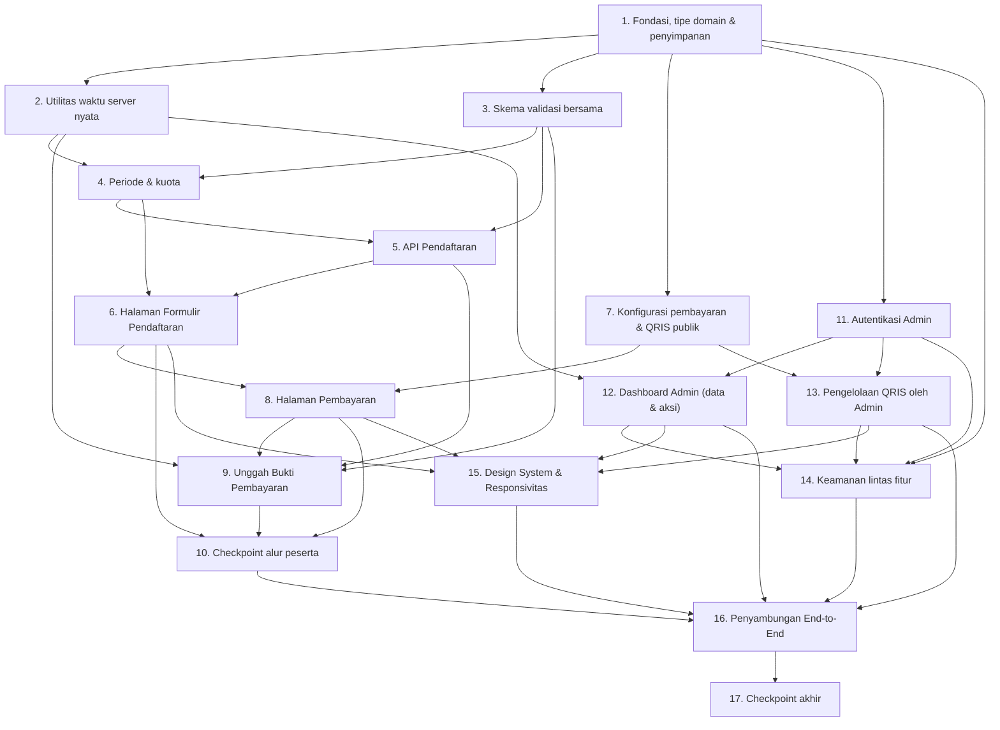

# Implementation Plan

## Overview

Rencana implementasi ini menurunkan desain **Pendaftaran Bimbel Widya Nusantara Academy** menjadi langkah-langkah pengkodean yang inkremental dan saling terhubung, dibangun **langsung di dalam** proyek webprofile yang sudah ada (Next.js 16 App Router + React 19 + TypeScript + Tailwind CSS v4). Setiap tugas membangun di atas tugas sebelumnya dan berakhir dengan penyambungan (wiring) end-to-end sehingga tidak ada kode yang menggantung/terpisah.

Bahasa implementasi: **TypeScript** (sesuai kontrak antarmuka pada `design.md`). Halaman baru **wajib** memakai design system RUBELA (`src/components/layout`: `Navbar`, `Footer`, `MobileMenu`; `src/components/ui`: `Container`, `Section`, `Heading`, `Card`, `Button`, `Badge`, `Breadcrumb`, `CTA`) dan helper `cn` di `src/lib/utils.ts`. Pengujian berbasis properti memakai **`fast-check`** selaras stack.

Catatan penyimpanan (pragmatis, ramah Vercel): gunakan lapisan abstraksi penyimpanan tunggal (`src/lib/storage` untuk data + `src/lib/object-storage` untuk berkas) sehingga implementasi konkret dapat dipilih tim — **rekomendasi**: Postgres terkelola (Vercel Postgres/Neon/Supabase) untuk data dan **Vercel Blob** untuk berkas (bukti bayar & QRIS), karena filesystem Vercel bersifat *ephemeral*. Seluruh kode fitur diakses melalui antarmuka abstraksi ini agar mudah diganti.

Konvensi penanda:
- Sub-tugas berakhiran `*` bersifat **opsional** (uji tambahan) dan boleh dilewati untuk MVP.
- Sub-tugas tanpa `*` adalah implementasi inti dan wajib dikerjakan.

## Tasks

- [ ] 1. Fondasi proyek, tipe domain, dan lapisan penyimpanan
  - [ ] 1.1 Siapkan dependensi, konstanta program, dan struktur folder fitur
    - Tambahkan dependensi: pustaka hashing kata sandi (bcrypt/argon2), klien basis data terkelola, SDK object storage (mis. `@vercel/blob`), pustaka pembuatan CSV, dan `fast-check` (devDependency)
    - Buat `src/lib/pendaftaran/constants.ts` berisi konstanta terkonfirmasi: `HARGA_DASAR=160000`, `KODE_UNIK="550"`, `NOMINAL_TRANSFER=160550`, `KUOTA_MAKS=100`, batas ukuran berkas `MAKS_BYTE=5242880`, periode `PERIODE_MULAI=2026-04-06T00:00:00.000+07:00`, `PERIODE_SELESAI=2026-09-27T23:59:59.999+07:00`, detail Bank Neo (rek `5859459250325726` a/n `Haposan Sinaga`), kontak resmi
    - _Requirements: 2.2, 3.1, 4.2, 5.1, 7.1_
  - [ ] 1.2 Definisikan tipe & enum domain
    - Buat `src/lib/pendaftaran/types.ts` untuk `Pendaftar`, `Admin`, `KonfigurasiPembayaran`, `BuktiPembayaran`, serta enum `StatusPendidikan`, `MetodePembayaran`, `StatusPendaftaran`
    - _Requirements: 1.1, 5.10, 6.14, 8.4_
  - [ ] 1.3 Implementasikan antarmuka lapisan penyimpanan data (repository abstraction)
    - Buat `src/lib/pendaftaran/repository.ts` dengan operasi CRUD Pendaftar, Admin, KonfigurasiPembayaran, dan penghitungan kuota; sediakan satu implementasi konkret (Postgres terkelola) di balik antarmuka
    - Sertakan skema/migrasi tabel dengan indeks pada `status`, `statusPendidikan`, `metodePembayaran`, `dibuatPada`
    - _Requirements: 6.14, 8.4_
  - [ ] 1.4 Implementasikan abstraksi object storage
    - Buat `src/lib/pendaftaran/object-storage.ts`: `simpan(berkas, {namaAcak})`, `hapus(kunci)`, `signedUrl(kunci, ttlDetik)`; implementasi konkret Vercel Blob/S3-compatible
    - Hasilkan nama objek acak tak-tertebak; jangan simpan berkas di disk aplikasi
    - _Requirements: 10.4_
  - [ ]* 1.5 Tulis unit test lapisan penyimpanan (mock/adapter in-memory)
    - Uji CRUD, penghitungan kuota, dan pembuatan signed URL
    - _Requirements: 6.14, 10.4_

- [ ] 2. Utilitas waktu server nyata (UTC store, WIB display, monotonik)
  - [ ] 2.1 Implementasikan utilitas waktu server
    - Buat `src/lib/pendaftaran/waktu.ts`: `waktuServerUtc()` (dari jam server, presisi ms), `keWib(utc)` (Asia/Jakarta UTC+07:00 via `Intl.DateTimeFormat`), `timestampMonotonik(sebelumnya)` yang menjamin nilai baru `>=` sebelumnya (tolak mundur), dan `gagalWaktu()` handling saat sumber waktu tidak tersedia
    - _Requirements: 8.1, 8.2, 8.3, 8.4, 8.6, 8.7, 8.8_
  - [ ]* 2.2 Tulis property test utilitas waktu
    - **Property 9: Timestamp memakai waktu nyata** — untuk operasi buat/perbarui acak, `diperbaruiPada >= dibuatPada` dan monoton tidak mundur
    - **Validates: Requirements 8.1, 8.3, 8.5, 8.6**
  - [ ]* 2.3 Tulis unit test konversi UTC↔WIB dan kegagalan sumber waktu
    - Uji konversi batas (00:00:00,000 & 23:59:59,999 WIB) dan penolakan clock skew
    - _Requirements: 8.3, 8.7, 8.8_

- [ ] 3. Skema validasi bersama (klien + server)
  - [ ] 3.1 Implementasikan validator field pendaftaran
    - Buat `src/lib/pendaftaran/validasi.ts`: validasi field wajib (trim), Nama (2–100), Asal Sekolah (2–150), Gmail (format email, ≤254), Nomor WhatsApp (8–15 digit, opsional `+`/`0`), Username Instagram (≤30, huruf/angka/titik/garis bawah, `@` diabaikan), Status Pendidikan enum
    - Kembalikan hasil per-field agar dapat dipakai klien dan server
    - _Requirements: 1.2, 1.3, 1.4, 1.5, 1.6, 1.7, 10.2_
  - [ ] 3.2 Implementasikan validasi Tanggal Lahir & usia
    - Tanggal kalender valid, tidak pada/masa depan, usia ≤ 100 tahun
    - _Requirements: 1.8_
  - [ ]* 3.3 Tulis property test validasi
    - **Property 3: Validasi field wajib** — data tak lengkap selalu ditolak; data lengkap valid selalu diterima
    - **Property 4: Status Pendidikan sah** — setiap Pendaftar tersimpan punya `statusPendidikan` yang sah
    - **Validates: Requirements 1.2, 1.5, 1.7**
  - [ ]* 3.4 Tulis unit test edge case validasi
    - Uji batas panjang, whitespace-only, format email/nomor/username tidak valid
    - _Requirements: 1.3, 1.4, 1.5, 1.6_

- [ ] 4. Logika penegakan periode & kuota
  - [ ] 4.1 Implementasikan pengecekan periode pendaftaran
    - Buat `src/lib/pendaftaran/periode.ts`: bandingkan `waktuServerUtc()` terhadap rentang inklusif WIB; abaikan waktu dari klien; sediakan status `BELUM_DIBUKA | AKTIF | DITUTUP`
    - _Requirements: 2.1, 2.2, 2.3, 2.4, 2.5, 2.6, 2.8_
  - [ ] 4.2 Implementasikan pengecekan + penambahan kuota atomik
    - Buat `src/lib/pendaftaran/kuota.ts`: hitung Pendaftar yang dihitung terhadap kuota (`MENUNGGU_PEMBAYARAN|MENUNGGU_VERIFIKASI|TERVERIFIKASI`, `DITOLAK` dikecualikan); operasi cek+increment sebagai satu transaksi atomik (mutual exclusion) sehingga tidak pernah melebihi 100
    - Sediakan `sisaKuota()` mengembalikan bilangan 0–100
    - _Requirements: 3.1, 3.2, 3.3, 3.4, 3.5, 3.6_
  - [ ]* 4.3 Tulis property test periode & kuota
    - **Property 7: Penegakan periode** — diterima jika dan hanya jika waktu WIB dalam rentang
    - **Property 8: Penegakan kuota** — untuk urutan pendaftaran apa pun, jumlah diterima tidak pernah melebihi 100 (termasuk konkuren/slot terakhir)
    - **Validates: Requirements 2.1, 2.2, 2.3, 2.4, 3.1, 3.3, 3.5, 3.6**

- [ ] 5. API Pendaftaran (POST /api/registrations)
  - [ ] 5.1 Implementasikan route handler pembuatan pendaftaran
    - Buat `src/app/api/registrations/route.ts`: validasi server otoritatif (Tugas 3), cek periode (Tugas 4.1), cek+increment kuota atomik (Tugas 4.2), simpan Pendaftar `MENUNGGU_PEMBAYARAN` dengan `dibuatPada`/`diperbaruiPada` waktu nyata; kembalikan `201` + `registrationId`
    - Tangani galat: `400` validasi, `403/409` periode, `409` kuota penuh, `503` penyimpanan gagal (atomik/rollback)
    - _Requirements: 1.9, 1.10, 2.3, 2.4, 2.5, 3.2, 3.3, 8.1, 10.3, 10.6_
  - [ ] 5.2 Terapkan rate limiting pada endpoint pendaftaran
    - Buat `src/lib/pendaftaran/rate-limit.ts` (per-IP) dan terapkan maksimum 10 permintaan/60 detik; balas `429` dengan indikasi waktu tunggu
    - _Requirements: 10.7, 10.8_
  - [ ]* 5.3 Tulis integration test API pendaftaran
    - Uji jalur sukses, penolakan validasi/periode/kuota, dan rate limit `429`
    - _Requirements: 1.9, 2.4, 3.3, 10.8_

- [ ] 6. Halaman Formulir Pendaftaran (/pendaftaran)
  - [ ] 6.1 Bangun halaman `/pendaftaran` dengan komponen RUBELA
    - Buat `src/app/pendaftaran/page.tsx` memakai `Navbar`, `Footer`, `Container`, `Section`, `Heading`, `Card`, `Button`, `Badge`; formulir 7 field ditandai wajib secara visual; tampilkan info program (Rp160.000/5 bulan)
    - _Requirements: 1.1, 9.1, 9.2, 9.8_
  - [ ] 6.2 Implementasikan validasi klien real-time & pengiriman
    - Panggil validator bersama (Tugas 3) saat input/blur; tampilkan/hapus galat per-field ≤500 ms; galat tampil utuh pada viewport ≥320 px; kirim ke `POST /api/registrations` lalu redirect ke `/pembayaran` saat sukses; pertahankan input saat gagal
    - _Requirements: 1.2, 1.9, 1.10, 1.11_
  - [ ] 6.3 Tampilkan sisa kuota & penegakan periode di UI
    - Ambil sisa kuota (0–100) dan status periode; nonaktifkan kontrol pengiriman & tampilkan info periode saat di luar periode atau kuota penuh
    - _Requirements: 2.7, 3.4_
  - [ ]* 6.4 Tulis component test formulir pendaftaran
    - Uji validasi real-time, disable saat di luar periode, dan tampilan sisa kuota
    - _Requirements: 1.11, 2.7, 3.4_

- [ ] 7. Konfigurasi pembayaran & endpoint QRIS publik
  - [ ] 7.1 Implementasikan perhitungan nominal Bank Neo & inisialisasi KonfigurasiPembayaran
    - Buat `src/lib/pendaftaran/pembayaran.ts`: nominal transfer = hargaDasar dengan 3 digit terakhir = kodeUnik (`160000` → `160550`); seed `KonfigurasiPembayaran` dengan detail Bank Neo statis
    - _Requirements: 4.1, 4.2, 4.3_
  - [ ] 7.2 Implementasikan endpoint publik `GET /api/payment/qris`
    - Buat `src/app/api/payment/qris/route.ts`: sajikan gambar QRIS Aktif terbaru (via signed URL/stream); jika belum ada, balas indikasi "belum tersedia" (bukan gambar kosong/rusak)
    - _Requirements: 4.5, 7.2, 7.3, 7.7_
  - [ ]* 7.3 Tulis property test nominal & QRIS aktif
    - **Property 6: Kebenaran nominal Transfer Bank Neo** — untuk harga apa pun, nominal berakhiran kode unik
    - **Property 10: QRIS aktif adalah yang diunggah admin** — setelah penggantian berulang, gambar yang disajikan selalu terbaru
    - **Validates: Requirements 4.1, 4.2, 4.4, 7.2, 7.3**

- [ ] 8. Halaman Pembayaran (/pembayaran)
  - [ ] 8.1 Bangun halaman `/pembayaran` dengan metode Bank Neo default
    - Buat `src/app/pembayaran/page.tsx` (komponen RUBELA); tampilkan rekening `5859459250325726` a/n `Haposan Sinaga`, nominal `Rp160.550`, penjelasan kode unik; Bank Neo terpilih default; pilih tepat satu metode
    - _Requirements: 4.1, 4.3, 4.4, 4.7, 9.1, 9.2_
  - [ ] 8.2 Implementasikan pemilihan QRIS dengan loading & penanganan galat
    - Ambil gambar dari `GET /api/payment/qris` saat QRIS dipilih; tampilkan loading; timeout 5 detik → pesan galat + coba lagi tanpa mengubah metode; sembunyikan/tandai QRIS tidak tersedia bila kosong atau bukan gambar valid; Bank Neo tetap tersedia
    - _Requirements: 4.5, 4.6, 4.8, 4.9, 4.10_
  - [ ]* 8.3 Tulis component test halaman pembayaran
    - Uji default Bank Neo, loading QRIS, fallback saat QRIS gagal/tak tersedia
    - _Requirements: 4.6, 4.8, 4.9_

- [ ] 9. Unggah Bukti Pembayaran (POST /api/registrations/{id}/payment-proof)
  - [ ] 9.1 Implementasikan validasi berkas bersama
    - Tambahkan ke `validasi.ts`: tipe MIME `image/jpeg|image/png`, ukuran >0 dan ≤5.242.880 byte, tolak 0 byte/rusak
    - _Requirements: 5.1, 5.2, 5.3, 5.4, 10.4, 10.5_
  - [ ] 9.2 Implementasikan route handler unggah bukti (idempoten)
    - Buat `src/app/api/registrations/[id]/payment-proof/route.ts`: validasi berkas server-side, simpan berkas (nama acak) ke object storage, simpan metode + referensi bukti, ubah status → `MENUNGGU_VERIFIKASI` dengan `diperbaruiPada` waktu nyata (≤5 detik); idempoten pada `registrationId` sama (ganti bukti, tanpa duplikat, id tetap); cegah unggah serentak untuk id sama; `404` bila id tak ditemukan
    - _Requirements: 5.6, 5.7, 5.8, 5.9, 5.10, 8.2, 10.6_
  - [ ] 9.3 Bangun komponen unggah bukti dengan pratinjau
    - Komponen di halaman `/pembayaran`: pilih berkas, tampilkan pratinjau ≤2 detik, sertakan metode terpilih, unggah, tampilkan konfirmasi; pertahankan status saat berkas ditolak
    - _Requirements: 5.2, 5.3, 5.4, 5.5, 5.6_
  - [ ]* 9.4 Tulis property test keamanan berkas & idempotensi
    - **Property 12: Keamanan berkas unggahan** — setiap berkas tersimpan `tipeMime ∈ {jpeg,png}` dan ukuran dalam batas
    - **Property 13: Idempoten unggah bukti** — unggah ulang menggantikan bukti tanpa membuat pendaftar ganda
    - **Validates: Requirements 5.2, 5.3, 5.6, 5.7, 10.3**
  - [ ]* 9.5 Tulis property test integritas & transisi status
    - **Property 1: Integritas status** — `status` selalu nilai yang sah
    - **Property 2: Transisi status sah** — perubahan hanya mengikuti alur yang diizinkan
    - **Property 5: Metode pembayaran sah dan bukti terkait** — status `MENUNGGU_VERIFIKASI|TERVERIFIKASI` ⇒ metode & buktiUrl terisi
    - **Validates: Requirements 4.5, 5.5, 5.8, 5.10, 6.8**

- [ ] 10. Checkpoint — Alur peserta end-to-end
  - Pastikan formulir → simpan → pembayaran → unggah bukti → status `MENUNGGU_VERIFIKASI` berfungsi utuh. Jalankan seluruh test. Tanyakan ke pengguna bila ada pertanyaan.

- [ ] 11. Autentikasi Admin
  - [ ] 11.1 Implementasikan login/logout/sesi admin
    - Buat `src/app/api/auth/login/route.ts` & `src/app/api/auth/logout/route.ts`: verifikasi kredensial terhadap hash, terbitkan sesi aman masa aktif 60 menit (≤3 detik); pesan galat generik untuk kredensial salah
    - Buat `src/lib/pendaftaran/sesi.ts` untuk penerbitan/validasi/penghapusan sesi
    - _Requirements: 6.1, 6.2, 6.13_
  - [ ] 11.2 Terapkan rate limiting & lockout login
    - Maksimum 5 permintaan/60 detik per-IP (`429`); 5 kegagalan berturut dalam 15 menit → kunci akun 15 menit dengan pesan penguncian
    - _Requirements: 6.3, 10.7, 10.8_
  - [ ]* 11.3 Tulis test autentikasi
    - Uji sukses, kredensial salah (pesan generik), lockout, dan rate limit
    - _Requirements: 6.2, 6.3, 10.8_

- [ ] 12. Dashboard Admin — data & aksi
  - [ ] 12.1 Implementasikan API daftar pendaftar (cari/filter/sortir/paginasi)
    - Buat `src/app/api/admin/registrations/route.ts`: pencarian (1–100 karakter), filter status/Status Pendidikan/Metode Pembayaran, sortir kolom (default `dibuatPada` menurun), paginasi (default 25, maks 100); daftar kosong tanpa galat; klem nomor halaman di luar rentang ke halaman valid terdekat
    - _Requirements: 6.4, 6.5, 6.6_
  - [ ] 12.2 Implementasikan API detail + signed URL bukti
    - Buat `src/app/api/admin/registrations/[id]/route.ts`: kembalikan seluruh data + signed URL bukti berlaku ≤15 menit (dan sesuai batas keamanan 300 detik pada Tugas 13.2)
    - _Requirements: 6.7_
  - [ ] 12.3 Implementasikan transisi status (verifikasi/tolak)
    - Buat `src/app/api/admin/registrations/[id]/status/route.ts`: ubah ke `TERVERIFIKASI|DITOLAK` hanya dari `MENUNGGU_VERIFIKASI` (transisi sah); tolak transisi tidak sah (pertahankan status, pesan galat); set `diperbaruiPada` waktu nyata
    - _Requirements: 6.8, 6.9, 6.10, 8.2_
  - [ ] 12.4 Implementasikan ekspor CSV
    - Buat `src/app/api/admin/registrations/export/route.ts`: hasilkan CSV konsisten dengan filter+sortir dashboard; header-saja bila tidak ada data
    - _Requirements: 6.11, 6.12_
  - [ ] 12.5 Bangun UI Dashboard Admin (/admin)
    - Buat `src/app/admin/page.tsx` (dan halaman login/detail) memakai komponen RUBELA: tabel daftar dengan cari/filter/sortir/paginasi, panel detail + pratinjau bukti, tombol verifikasi/tolak, tombol ekspor CSV; arahkan ke login bila sesi kedaluwarsa
    - _Requirements: 6.4, 6.5, 6.7, 6.8, 6.13, 6.14, 9.1, 9.2_
  - [ ]* 12.6 Tulis property test transisi status & konsistensi CSV
    - **Property 2: Transisi status sah** (sisi admin) — verifikasi/tolak hanya dari `MENUNGGU_VERIFIKASI`
    - **Property 14: Konsistensi ekspor CSV** — untuk filter identik, isi & urutan CSV = data dashboard
    - **Validates: Requirements 6.8, 6.9, 6.11**
  - [ ]* 12.7 Tulis integration test dashboard admin
    - Uji cari/filter/sortir/paginasi, klem halaman, daftar kosong, detail, dan kedaluwarsa sesi
    - _Requirements: 6.4, 6.5, 6.6, 6.13_

- [ ] 13. Pengelolaan Gambar QRIS oleh Admin (PUT /api/admin/payment/qris)
  - [ ] 13.1 Implementasikan handler unggah/ganti QRIS terproteksi
    - Buat `src/app/api/admin/payment/qris/route.ts`: hanya admin terautentikasi; terima JPG/PNG ≤5 MB, simpan (nama acak) & jadikan QRIS Aktif ≤5 detik, set `qrisDiperbaruiPada` waktu nyata; tolak MIME/ukuran/berkas tidak valid (pertahankan QRIS lama); `401` tanpa auth; `503`/rollback bila penyimpanan gagal (pertahankan QRIS lama)
    - _Requirements: 7.1, 7.2, 7.3, 7.4, 7.5, 7.6, 7.8, 10.1, 10.4_
  - [ ] 13.2 Bangun UI pengelolaan QRIS di dashboard admin
    - Panel unggah/ganti gambar QRIS dengan pratinjau memakai komponen RUBELA; tampilkan waktu pembaruan terakhir (WIB)
    - _Requirements: 7.1, 7.5, 9.1_
  - [ ]* 13.3 Tulis integration test pengelolaan QRIS
    - Uji ganti QRIS → `GET /api/payment/qris` menyajikan terbaru; penolakan berkas tidak valid mempertahankan QRIS lama; `401` tanpa auth
    - _Requirements: 7.3, 7.4, 7.6_

- [ ] 14. Keamanan lintas fitur
  - [ ] 14.1 Implementasikan isolasi & proteksi endpoint admin
    - Buat middleware/guard `src/lib/pendaftaran/admin-guard.ts` untuk seluruh `/api/admin/*` (termasuk unggah QRIS): tanpa sesi valid balas `401` dengan pesan generik (tanpa membocorkan jejak tumpukan, struktur DB, nama tabel/berkas, atau data peserta), tanpa operasi tulis
    - _Requirements: 10.1_
  - [ ] 14.2 Perkuat keamanan berkas & signed URL
    - Pastikan seluruh penyimpanan berkas: batasi MIME JPG/PNG, ukuran ≤5.242.880 byte, nama objek acak tak-tertebak, dan bukti disajikan via signed URL kedaluwarsa 300 detik
    - _Requirements: 10.4, 10.5_
  - [ ] 14.3 Pastikan operasi tulis atomik & penanganan galat penyimpanan
    - Bungkus operasi tulis DB/object storage agar atomik; saat penyimpanan tak tersedia balas `503` dan pertahankan keadaan data (tanpa perubahan sebagian)
    - _Requirements: 8.8, 10.6_
  - [ ]* 14.4 Tulis property test isolasi akses admin
    - **Property 11: Isolasi akses admin** — setiap permintaan `/api/admin/*` tanpa sesi valid ditolak `401` tanpa membocorkan data
    - **Validates: Requirements 10.1**
  - [ ]* 14.5 Tulis integration test keamanan
    - Uji `401` endpoint admin, `400` validasi server, `429` rate limit, `503` penyimpanan gagal
    - _Requirements: 10.1, 10.3, 10.6, 10.8_

- [ ] 15. Integrasi Design System RUBELA & Responsivitas
  - [ ] 15.1 Sambungkan layout & navigasi RUBELA pada semua halaman baru
    - Pastikan `/pendaftaran`, `/pembayaran`, `/admin` menempatkan `Navbar` teratas, `Footer` terbawah, konten dibungkus `Container` + `Section`; tambahkan `Breadcrumb`/`CTA` bila relevan; tanpa komponen duplikat
    - _Requirements: 9.1, 9.2, 9.8_
  - [ ] 15.2 Terapkan responsivitas & target sentuh
    - Terapkan breakpoint (smartphone <640px, tablet 640–<1024px, laptop ≥1024px) tanpa scroll horizontal; `MobileMenu` di bawah md (768px) & Navbar penuh ≥768px; elemen interaktif minimal 44x44 px pada smartphone; hanya token gaya RUBELA yang ada
    - _Requirements: 9.3, 9.4, 9.5, 9.6, 9.7, 9.8_
  - [ ]* 15.3 Tulis test responsivitas/tata letak
    - Verifikasi tanpa scroll horizontal di tiga rentang viewport, MobileMenu di bawah md, dan target sentuh 44px
    - _Requirements: 9.3, 9.4, 9.5, 9.6, 9.7_

- [ ] 16. Penyambungan End-to-End & pengujian menyeluruh
  - [ ] 16.1 Sambungkan seluruh rute, navigasi, dan tautan antar halaman
    - Tambahkan tautan navigasi ke `/pendaftaran` dari webprofile; hubungkan redirect pendaftaran→pembayaran; tautkan login→dashboard admin; pastikan tidak ada kode menggantung/tak terintegrasi
    - _Requirements: 1.9, 6.13, 6.14_
  - [ ]* 16.2 Tulis integration test alur end-to-end
    - Alur peserta lengkap (daftar→bayar→unggah→verifikasi) dan alur admin (login→kelola→ekspor→ganti QRIS)
    - _Requirements: 1.9, 5.6, 6.8, 6.11, 7.3_

- [ ] 17. Checkpoint akhir — Pastikan semua test lulus
  - Jalankan seluruh uji unit, properti (`fast-check`, minimal 100 iterasi per properti), dan integrasi. Pastikan semua fitur saling terhubung dan lulus. Tanyakan ke pengguna bila ada pertanyaan.

## Notes

- Sub-tugas bertanda `*` bersifat opsional (uji tambahan) dan dapat dilewati untuk MVP lebih cepat.
- Setiap tugas merujuk sub-requirement spesifik untuk keterlacakan.
- Uji berbasis properti memakai `fast-check` (minimal 100 iterasi) dan merujuk properti pada bagian *Correctness Properties* `design.md`.
- Tag uji properti: **Feature: pendaftaran-bimbel, Property {nomor}: {judul}**.
- Checkpoint (Tugas 10 & 17) menjamin validasi inkremental.
- Seluruh timestamp memakai waktu server nyata (UTC disimpan, WIB ditampilkan); berkas disimpan di object storage (bukan disk aplikasi Vercel yang ephemeral).

## Task Dependency Graph




```json
{
  "waves": [
    { "wave": 1, "tasks": ["1"] },
    { "wave": 2, "tasks": ["2", "3", "7", "11"] },
    { "wave": 3, "tasks": ["4", "12", "13"] },
    { "wave": 4, "tasks": ["5", "14"] },
    { "wave": 5, "tasks": ["6"] },
    { "wave": 6, "tasks": ["8"] },
    { "wave": 7, "tasks": ["9", "15"] },
    { "wave": 8, "tasks": ["10"] },
    { "wave": 9, "tasks": ["16"] },
    { "wave": 10, "tasks": ["17"] }
  ]
}
```
